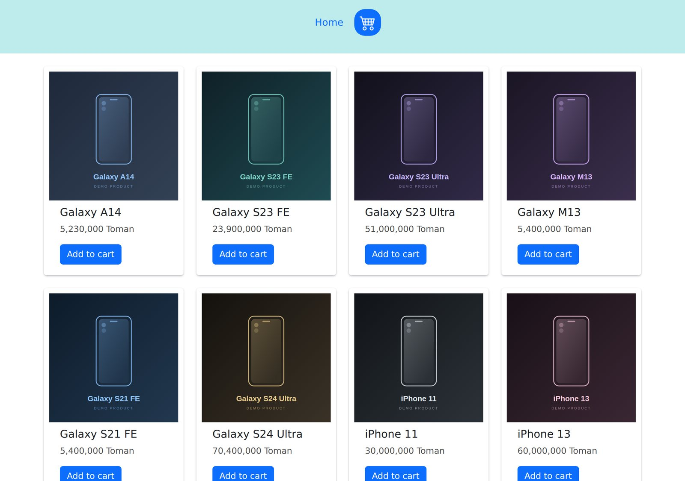
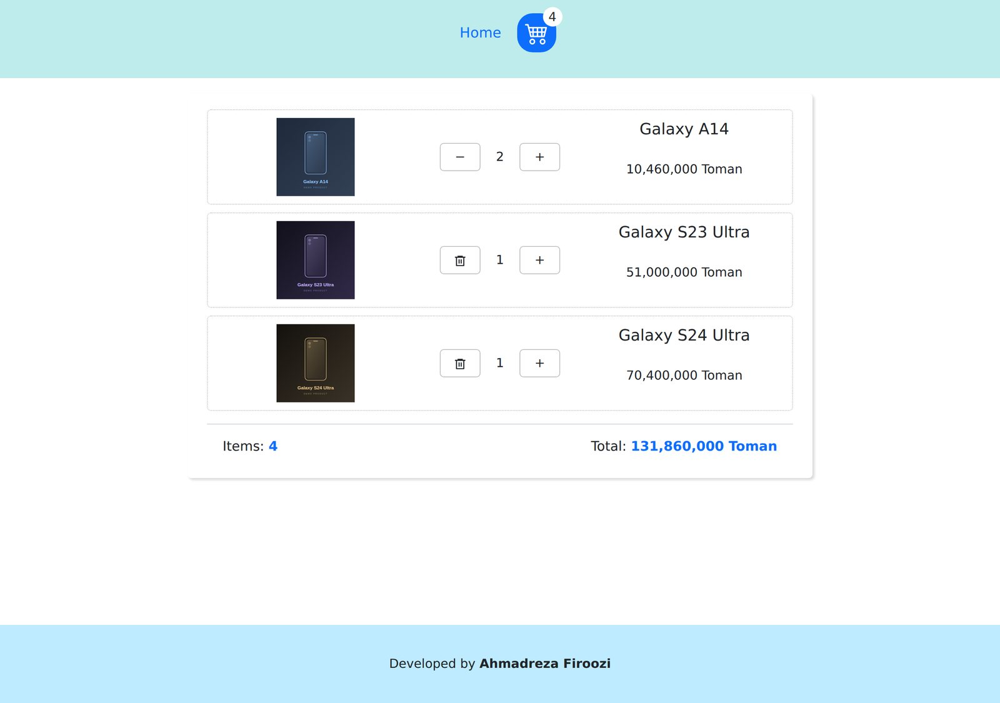
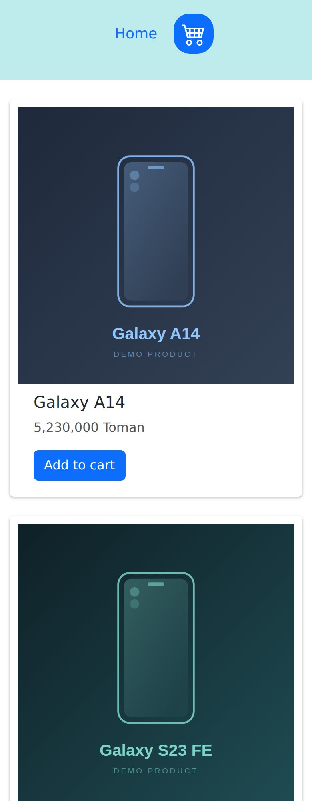

<div dir="rtl">

# فروشگاه موبایل — سبد خرید با Context API

یک فروشگاه کوچک موبایل با **React 19** و **Vite** که مدیریت state سبد خرید را با **Context API** و بدون هیچ کتابخانهٔ بیرونی انجام می‌دهد. هدف پروژه، پیاده‌سازی تمیز یک سبد خرید بدون Prop Drilling است.

**[▶ مشاهدهٔ دمو](https://context-pro-kohl.vercel.app/)** · **[سورس‌کد](https://github.com/AhmadFiroozi/context-pro)**



---

## قابلیت‌ها

- **فهرست محصولات** — گرید واکنش‌گرا با React-Bootstrap، از یک تا چهار ستون بسته به اندازهٔ صفحه.
- **سبد خرید کامل** — افزودن، کم و زیاد کردن تعداد، حذف خودکار وقتی تعداد به صفر می‌رسد، و محاسبهٔ جمع کل.
- **وضعیت زنده روی کارت** — دکمهٔ هر محصول نشان می‌دهد چند عدد از آن در سبد است.
- **نشانگر سبد در هدر** — تعداد کل اقلام، هماهنگ در همهٔ صفحه‌ها.
- **حالت سبد خالی** و **صفحهٔ ۴۰۴ اختصاصی**.
- **بدون وابستگی بیرونی برای داده** — محصولات و تصاویرشان داخل خود پروژه هستند، پس دمو به هیچ سرور دیگری وابسته نیست.

| سبد خرید | نمای موبایل |
|---|---|
|  |  |

---

## تکنولوژی‌ها

| بخش | تکنولوژی |
|---|---|
| فریم‌ورک | React 19 |
| ابزار build | Vite |
| مدیریت state | Context API + hook سفارشی |
| مسیریابی | React Router v7 — <code dir="ltr">Layout</code> و <code dir="ltr">Outlet</code> |
| استایل | React-Bootstrap + CSS ماژولار |
| آیکون | react-icons |

---

## معماری state

کل منطق سبد در یک Provider جمع شده و کامپوننت‌ها از طریق یک hook سفارشی به آن دسترسی دارند:

</div>

<div dir="ltr">

```
main.jsx
└── <AppProvider>          ← state سبد خرید
    └── <App>
        └── <Layout>       ← Navbar + Outlet + Footer
            ├── HomePage   → ProductList → ProductItem
            └── CartPage   → Cart → ProductItemInCart
```

</div>

<div dir="rtl">


### hook سفارشی به‌جای useContext مستقیم

</div>

<div dir="ltr">

```js
export function useCart() {
  const context = useContext(AppContext);

  if (!context) {
    throw new Error("useCart must be used inside <AppProvider>");
  }

  return context;
}
```

</div>

<div dir="rtl">


اگر کامپوننتی بیرون از Provider رندر شود، به‌جای خطای مبهم <code dir="ltr">Cannot read property of null</code>، پیام روشن می‌گیریم.

### به‌روزرسانی تغییرناپذیر (Immutable)

هر تغییر در سبد یک آرایه و آبجکت **جدید** برمی‌گرداند، نه اینکه مقدار موجود را دستکاری کند. React تغییر state را با مقایسهٔ مرجع تشخیص می‌دهد؛ دستکاری در جا می‌تواند رندر مجدد را رد کند و دادهٔ اصلی محصولات را هم خراب کند:

</div>

<div dir="ltr">

```js
const addToCart = (product) => {
  setCartItems((prev) => {
    const existing = prev.find((item) => item.id === product.id);

    if (existing) {
      return prev.map((item) =>
        item.id === product.id ? { ...item, count: item.count + 1 } : item
      );
    }

    return [...prev, { ...product, count: 1 }];
  });
};
```

</div>

<div dir="rtl">


جمع کل و تعداد کل هم به‌عنوان state ذخیره نمی‌شوند و هر بار از روی <code dir="ltr">cartItems</code> محاسبه می‌شوند تا هیچ‌وقت با محتوای سبد ناهماهنگ نشوند.

---

## چرا Context API و نه Redux؟

این پروژه عمداً از Redux استفاده نمی‌کند. Context برای این حجم از state انتخاب درستی است چون:

- فقط **یک** بخش state سراسری وجود دارد (سبد خرید)
- هیچ عملیات async ای در کار نیست — داده‌ها استاتیک‌اند
- تعداد کامپوننت‌های مصرف‌کننده کم است، پس رندرهای اضافیِ Context مسئله‌ساز نمی‌شود

جایی که Context کم می‌آورد و باید سراغ Redux Toolkit رفت: چند بخش state مستقل، درخواست‌های async با وضعیت loading و error، ابزار DevTools برای دیباگ، یا وقتی رندرهای اضافی به گلوگاه عملکرد تبدیل شوند. نمونهٔ همان رویکرد را در پروژهٔ [Redux-pro](https://github.com/AhmadFiroozi/Redux-pro) پیاده کرده‌ام.

---

## ساختار پروژه

</div>

<div dir="ltr">

```
context-pro/
├── public/images/phones/       # product images (SVG)
├── src/
│   ├── db.js                   # static product data
│   ├── components/
│   │   ├── context/
│   │   │   ├── cartContext.js  # context object + useCart hook
│   │   │   └── AppContext.jsx  # provider component
│   │   ├── layout/Layout.jsx   # Navbar + Outlet + Footer
│   │   ├── productList/
│   │   ├── productItem/
│   │   ├── cart/
│   │   ├── navbar/
│   │   └── Footer/
│   ├── pages/                  # HomePage, CartPage
│   └── App.jsx                 # routes + 404
└── vercel.json                 # SPA rewrite rules
```

</div>

<div dir="rtl">


> <code dir="ltr">cartContext.js</code> و <code dir="ltr">AppContext.jsx</code> عمداً جدا هستند: فایلی که کامپوننت export می‌کند نباید چیز دیگری هم export کند، وگرنه React Fast Refresh در حالت توسعه از کار می‌افتد.

---

## راه‌اندازی

**پیش‌نیاز:** Node.js نسخهٔ ۲۰٫۱۹ یا بالاتر.

</div>

<div dir="ltr">

```bash
git clone https://github.com/AhmadFiroozi/context-pro.git
cd context-pro
npm install
npm run dev
```

</div>

<div dir="rtl">


این پروژه API ندارد؛ داده‌ها از <code dir="ltr">src/db.js</code> خوانده می‌شوند، پس فقط همین یک دستور کافی است.

### سایر دستورها

</div>

<div dir="ltr">

```bash
npm run build     # production build -> dist/
npm run preview   # preview the production build
npm run lint      # ESLint
```

</div>

<div dir="rtl">


---

## دیپلوی

دیپلوی‌شده روی **Vercel** (پلن Hobby). چون پروژه کاملاً استاتیک است، فقط یک نکته دارد: مسیرهایی مثل <code dir="ltr">/cart</code> نباید هنگام رفرش خطای ۴۰۴ بدهند. فایل <code dir="ltr">vercel.json</code> این را حل می‌کند:

</div>

<div dir="ltr">

```json
{
  "rewrites": [
    { "source": "/(.*)", "destination": "/index.html" }
  ]
}
```

</div>

<div dir="rtl">


Vercel اول فایل‌های واقعی را سرو می‌کند و فقط مسیرهایی که فایلی برایشان وجود ندارد به <code dir="ltr">index.html</code> هدایت می‌شوند تا React Router خودش تصمیم بگیرد.

---

## مسیر توسعه

مواردی که می‌دانم هنوز جای کار دارند:

- **ماندگاری سبد خرید** — با رفرش صفحه سبد خالی می‌شود؛ <code dir="ltr">localStorage</code> ساده‌ترین قدم بعدی است.
- **صفحهٔ جزئیات محصول** با روت پویا.
- **جستجو و مرتب‌سازی** بر اساس قیمت.
- **بومی‌سازی** — رابط کاربری فعلاً انگلیسی است در حالی که قیمت‌ها به تومان‌اند.

---

## نکته

این یک پروژهٔ نمونه‌کار است. محصولات، قیمت‌ها و تصاویر ساختگی‌اند و هیچ فرایند پرداختی در کار نیست.

ساخته‌شده توسط [احمدرضا فیروزی](https://github.com/AhmadFiroozi).


</div>